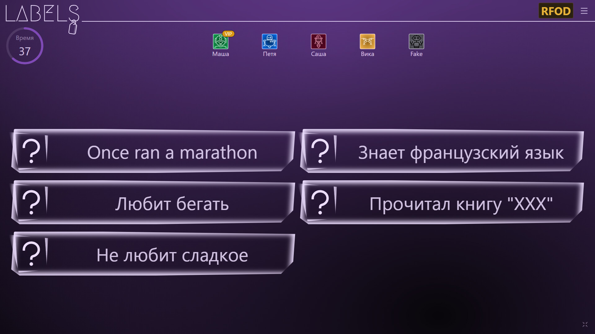
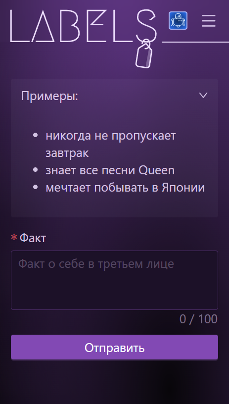
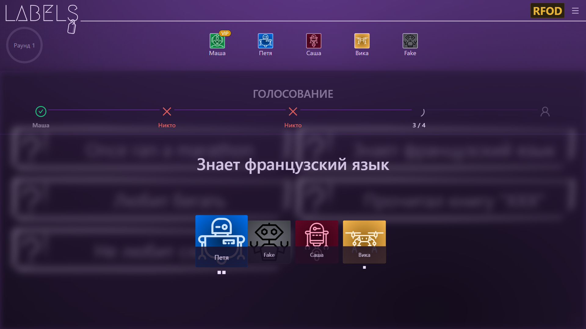
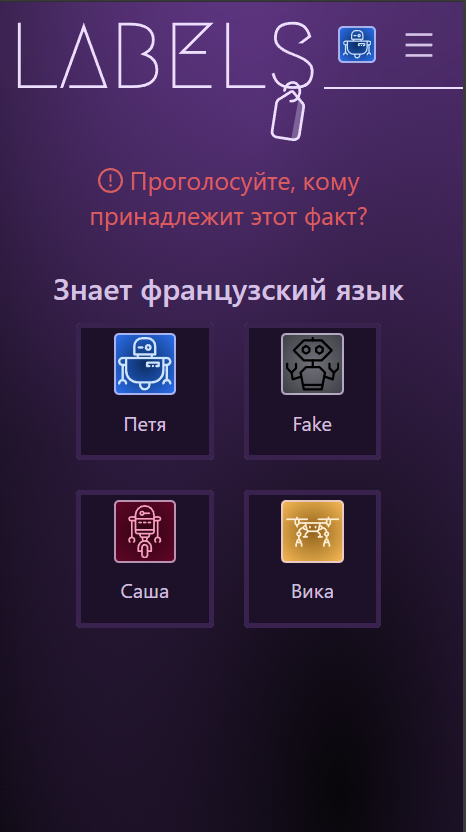
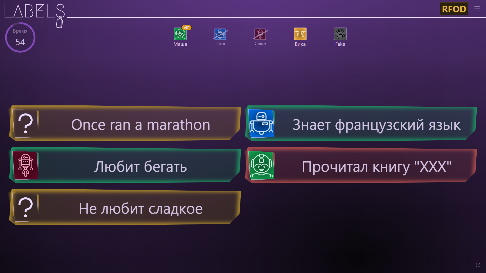
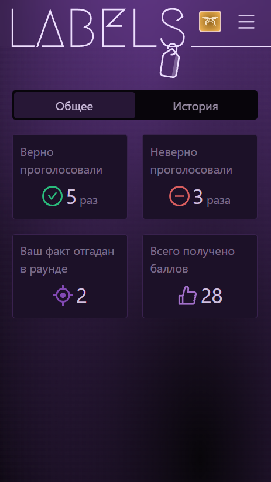
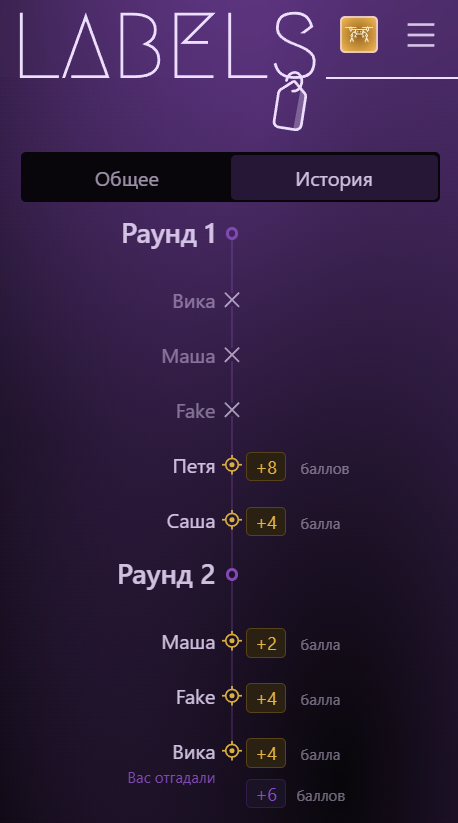
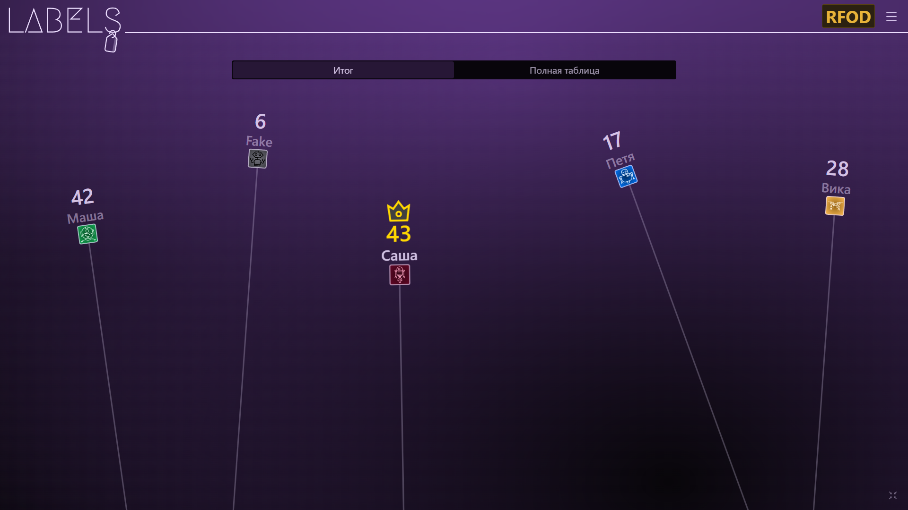
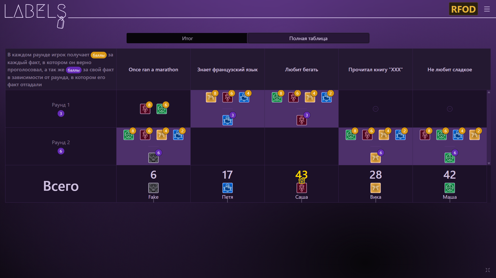

Production https://game-labels.vercel.app/

Development https://game-labels-preview.vercel.app/

#  Labels Game

## Overview

Labels Game is a web-based multiplayer game. Players connect and interact in real-time using WebSockets, competing according to the game's unique rules. The game requires all players to join a session, with an additional connection for a shared screen display.

## Features

- **Multiplayer Gameplay**: Players connect via WebSockets for real-time interaction.
- **Shared Screen Connection**: A dedicated connection for a communal game display.
- **Rules Page**: A dedicated page outlining the [game rules](https://game-labels.vercel.app/about) for players.

## Technologies Used

- **Frontend**: React
- **Real-Time Communication**: WebSocket

## Related Projects

- [Backend Repository](https://github.com/EAGulevich/labels-server) - The backend server powering the WebSocket communication and game logic.

## Screens

### Input facts

### Discussion and voting

### Player results

### All players results

